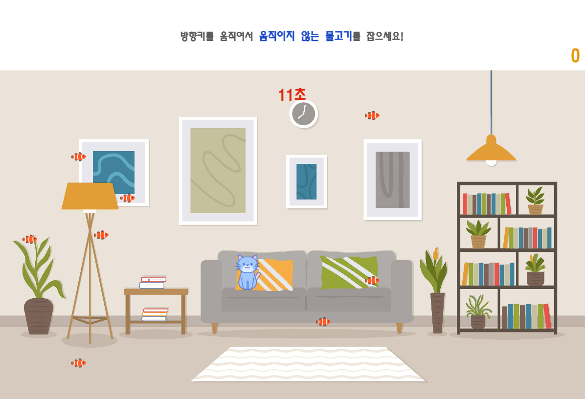
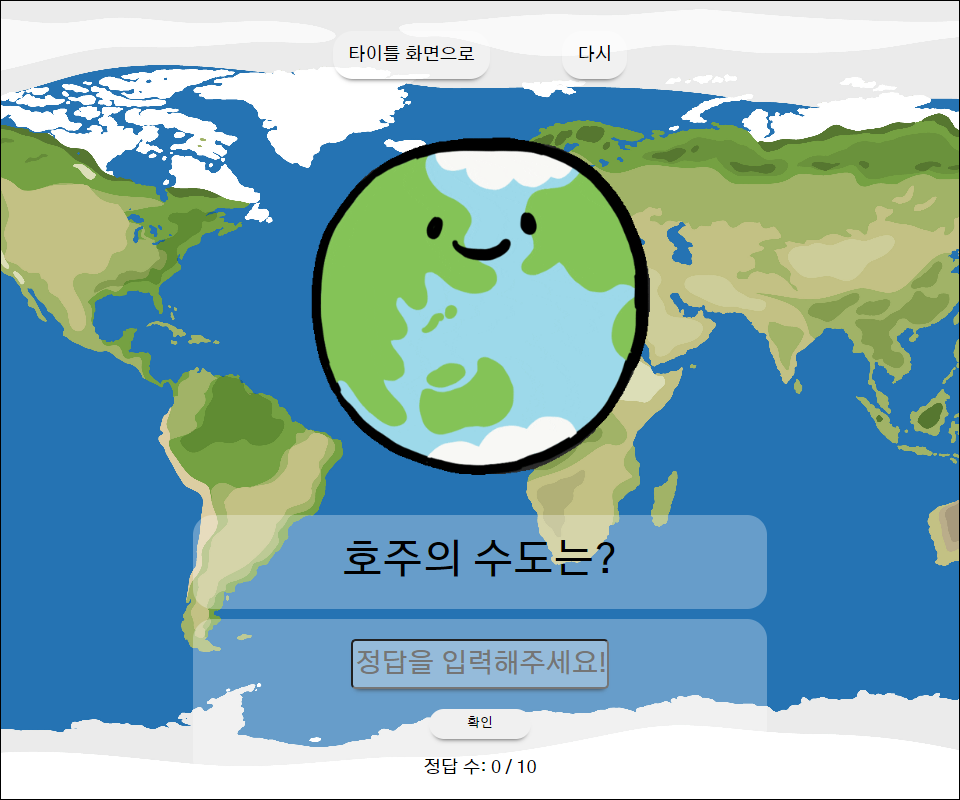

# 코로나 블루 뿌셔뿌셔!!
## 목차

[1. 프로젝트 개요](#ⅰ-프로젝트-개요)

[2. 프로젝트 소개](#ⅱ-프로젝트-소개)

[3. 개선방향](#ⅲ-개선방향)

# **Ⅰ**. 프로젝트 개요

## 미니게임

### 개발 기간

---

**2023.03.27~2023.03.31**

프로젝트 명 : **코로나 블루 뿌셔뿌셔** 
한줄 소개: **코로나19** 장기화로 지친 일상에 소소한 **즐거움**을 주기위해 제작을 하였다.
### 배경

-   코로나 팬더믹이 장기화되면서 코로나 블루를 겪는 사람들이 빠르게 증가하고 있습니다.
코로나19로 인한 자가격리나 사회적 거리두기 등으로 일상생활에 큰 변화가 닥치면서 생긴 장기적인 우울감과 무기력증은 전반적인 정신기능 저하 및 불안장애로 악화할 수 있습니다.
간단한 게임을 통하여 코로나블루를 극복하고자 이번 프로젝트를 실시하게 되었습니다.

### 기대효과

- 간단한 게임을 통해 **우울감**과 **무력감** 해소
- **불안감 해소** 및 **심신 치유**

# **Ⅱ. 프로젝트 소개**

## 미니게임 화면

#### 미니게임1

-   집사야 밥줘!! 

#### 미니게임2

-   그림 퍼즐 

#### 미니게임3

-   수도 퀴즈 

#### 미니게임4

-   순간반응속도 측정 

# **Ⅲ. 개선방향**

- 통일성 있는 UI 개선
- 다인 게임화 기능
- 랭크 시스템 도입
- 코드구조 개선 및 모듈화 작업
- 모바일 play 환경 개선

### 팀원 소개

|  |  |  |  |
| -------------------------------------------------- | -------------------------------------------------- | -------------------------------------------------- | -------------------------------------------------- |
| **박수민** (팀장)                             | **한세진** (팀원)                             | **이재필** (팀원)                             | **윤영식** (팀원)                             |

## 회고

| 이름         | 내용 |
| ------------ | ----------------- |
| 박수민 (팀장)&nbsp;&nbsp;  | 이번 프로젝트를 통해 이론으로만 알고 있었던 자바스크립트 지식들을 실제로 적용해보면서 자바스크립트에 대한 이해도를 높이고 개발에 대한 흥미가 커지는 계기가 되었습니다. 또한 프로젝트를 진행하는 동안 의욕이 넘치고 성실한 팀원들과 함께 할 수 있어서너무 감사하고, 개발하는 내내 진심으로 너무너무 행복했습니다! ^^
| 한세진 &nbsp;&nbsp;      | 게임 핵심기능에 집중해서 일단 만들고 보자 하는 마음으로 코드를 짰더니 개발중 코드수정이 너무 힘들었습니다. 코드를 짜기 전에 전체적인 구조를 먼저 잡고 시작하는 것이 중요함을 느꼈습니다.
| 이재필  &nbsp;&nbsp;     | 본 프로젝트를 통해 자바스크립트 구현이 생각 이상으로 어려웠다는 점을 실감했고, CSS 구현에 대한 이해도가 미흡해 초기에 기획한 여러 사안들이 폐기되어 아쉬웠습니다.
| 윤영식  &nbsp;&nbsp;     | 이번 프로젝트를 하면서 처음에 계획했던 카드 짝맞추기를 만들려고 하였지만 Javascript에서 실력이 많이 부족하였고 도중에 반응게임으로 바꿨지만 미숙하게 만들었습니다. 이 계기로 복습과 계획이 중요하다는것을 느꼈습니다. 
